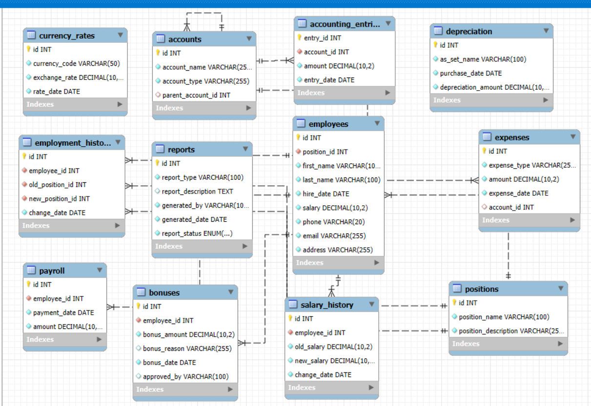

# 💼 Accounting Database System for Company

This project is a comprehensive **relational database** designed to manage various accounting and HR needs of a company. Built with **MySQL**, it covers employee management, payroll, expenses, and currency exchange tracking.

---

## 🗂️ Project Overview

The database includes tables for:

- **Employees** — personal data and employment history  
- **Positions** — job roles and descriptions  
- **Salaries** — payroll data and salary history  
- **Employee History** — tracking changes in positions and salaries  
- **Currency Rates** — storing exchange rates for multi-currency operations  
- **Bonuses** — additional employee payments  
- **Expenses** — company expenses tracking  
- **Accounts** — financial accounts management  

---

## ⚙️ Advanced Features

- Custom **tasks and queries** with varied business logic  
- Implementation of **triggers** to automate data integrity and business rules  
- Use of **stored procedures** with cursors for complex data processing  

---

## 🚀 How to Use

1. **Clone this repository**

```bash
git clone https://github.com/nnezirova/Accounting-System.git
cd Accounting-System

🛠 Technologies Used
MySQL

📸 Preview
